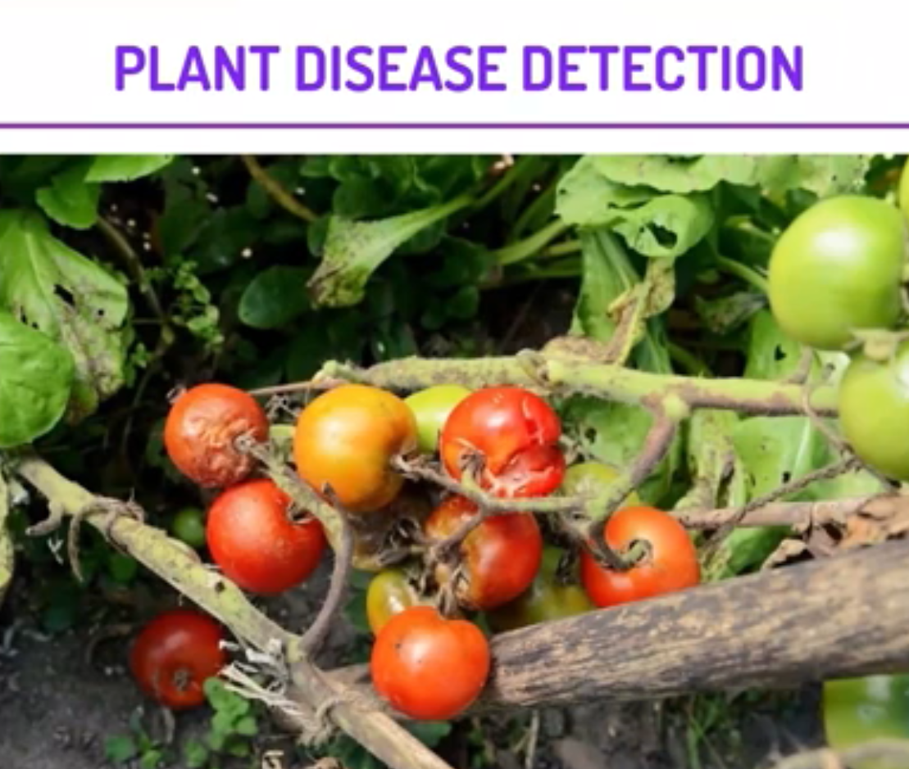

  
 

<h3> Link-https://plant-disease-flask-pianalytix.herokuapp.com/</h3>
<i>

<h3><i>
IN THIS PROJECT, WE WILL CREATE A CONVOLUTIONAL NEURAL NETWORK WHICH WILL BE ABLE TO PREDICT WHETHER A PLANT IS SUFFERING FROM A DISEASE. WE WILL USE DIFFERENT LAYERS AND OTHER HYPERPARAMETERS FOR BUILDING, TRAINING, AND TESTING THIS CLASSIFICATION MODEL. WE WILL BE USING TENSORFLOW AND KERAS FOR THIS PROJECT.</h3>

 

  <h2>The Steps to solve the problem </h2>

<h3>
1. MOUNTING GOOGLE DRIVE ON COLLAB NOTEBOOK  
2. VISUALIZING THE IMAGES THAT WE WILL BE WORKING ON  
3.FINDING OUT THE MEAN OF THE DIMENSIONS AND RESIZING ALL IMAGES ACCORDINGLY.  
4. CONVERTING THE IMAGES INTO A NUMPY ARRAY AND NORMALIZE THEM.  
5. CHECKING CLASS IMBALANCE.  
6. SPLITTING THE DATA AND PERFORMING ONE-HOT ENCODING.  
7. CREATING THE MODEL ARCHITECTURE, COMPILING THE MODEL AND THEN FITTING IT.  
8.PLOTTING THE ACCURACY AND LOSS AGAINST EACH EPOCH.  
9. PREPROCESSING THE TEST DATA AND MAKE PREDICTIONS ON IT.  
10. VISUALIZING THE ORIGINAL AND PREDICTED LABELS FOR THE TEST IMAGES.  
</h3>

     
  
  <h1> Screenshots </h1>
  <h2> Input Screen </h2>
 
  
    
  
<h2> Output Screen </h2> 

   
    

 
### Give It a Star if you liked the project 
 </i>
